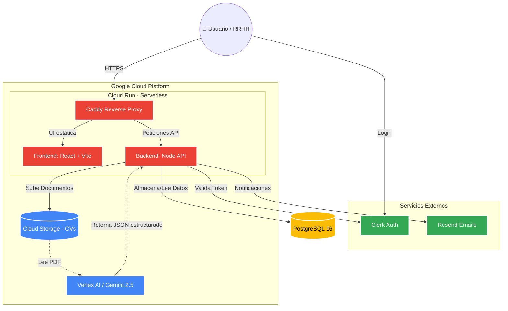

# 🚀 Vera Hiring Tracker (AI-Powered)


---

## 💼 Resumen Ejecutivo y Valor de Negocio

**Vera** es una plataforma *Full-Stack* de nivel empresarial, diseñada con un enfoque inicial hacia el **sector bancario y financiero**, que gestiona el **ciclo de vida completo** del seguimiento de candidatos: desde la recepción de la postulación hasta su incorporación final (*onboarding*).

El enorme valor que Vera aporta a los departamentos de Recursos Humanos radica en su capacidad de ir más allá del simple almacenamiento de documentos. Utilizando Inteligencia Artificial Avanzada, el sistema:

- **Se alinea con los Requerimientos:** Analiza el nivel de compatibilidad (*fit*) entre el candidato, la cultura de la empresa y las exigencias técnicas del puesto.
- **Detecta Puntos Fuertes y Débiles:** Basándose estrictamente en las instrucciones y protocolos configurados por el departamento de RR.HH., la IA señala áreas de refuerzo y habilidades destacadas para preparar mejor las entrevistas. El hecho de seguir al pie de la letra este protocolo corporativo dota al sistema de **fiabilidad, transparencia y trazabilidad** en cada decisión.
- **Gestión Integral:** Permite realizar un seguimiento centralizado de las fases del candidato, registro de entrevistas, calificaciones de los reclutadores y toma de decisiones.

> 🎥 **Recursos Adicionales:** El proyecto cuenta con un [Vídeo Explicativo](./artifacts/vera-video-explainer) y un manual de ayuda operativo.

> [!WARNING]
> **Aviso sobre IA Responsable y Datos de Prueba:** Los datos, currículums e información de candidatos utilizados en esta demostración son **estrictamente sintéticos** y generados con fines de prueba. Al tratarse de un prototipo, cualquier organización que desee llevar un sistema de este tipo a producción debe someterlo a rigurosas auditorías éticas, sesgo algorítmico y aplicar las buenas prácticas internacionales de **IA Responsable** antes de operar con datos reales.

---

## 🏗️ Arquitectura y Evolución (Monolito a Serverless)

*El siguiente diagrama interactivo se ha generado automáticamente:*



Vera ha superado una transformación técnica profunda, pasando de un prototipo monolítico construido en Replit a una **Arquitectura Serverless** de alto rendimiento en Google Cloud Platform. 

Esta migración estratégica permitió implementar:
- **Configuraciones de Privacidad y Red:** Aislamiento de servicios, gestión segura de secretos y despliegues controlados orientados a cumplir los altos estándares de seguridad y privacidad (PII) requeridos en la banca.
- **Auto-escalado y Costos:** Despliegue en **Google Cloud Run** (auto-escalado a cero) usando contenedores de Docker.
- **Procesamiento de IA Agnóstico (Gemini / OpenAI):** Integración directa y multimodal entre Google Cloud Storage y Vertex AI usando **Gemini 2.5 Flash** por defecto para despliegues nativos en GCP. Sin embargo, el sistema está diseñado para ser flexible y soporta la configuración nativa con modelos de **OpenAI** si así se requiere, adaptándose a cualquier ecosistema. A diferencia del OCR tradicional frágil, Vera envía los PDFs directamente a la IA para "leer" visualmente la estructura y devolver un JSON estructurado con el perfil del candidato.
- **Separación de Responsabilidades:** Frontend ágil en React/Vite, Backend robusto en Node.js (Express) con PostgreSQL, y autenticación externalizada y segura a través de **Clerk**.

---

## 🌟 Características Principales a Nivel Técnico

1. **Extracción Multimodal con IA:** Cero dependencias de librerías frágiles de análisis de texto. Lectura visual directa del documento.
2. **Control de Acceso (Allowlist):** Restricciones de seguridad avanzadas para permitir que solo usuarios pre-aprobados accedan a posiciones específicas o paneles de administración.
3. **Infraestructura Inmutable (Docker):** Todo el entorno de desarrollo y producción está contenido en `docker-compose`, garantizando paridad entre lo que se programa y lo que se despliega.

---

## 🛠️ Instalación y Uso Local (Docker)

La forma más sencilla de probar Vera en tu máquina local es utilizando Docker.

1. **Clonar el repositorio y configurar variables de entorno:**
   ```bash
   cp docker/.env.example docker/.env
   # Asegúrate de rellenar las claves de Clerk y la Base de Datos en el nuevo archivo .env
   ```

2. **Levantar los contenedores:**
   ```bash
   cd docker
   docker compose up -d --build
   ```

3. **Acceder a la aplicación:**
   Abre `http://localhost` (o el puerto configurado por el proxy Caddy) en tu navegador web.

---

## 📚 Documentación Técnica

Para los desarrolladores, arquitectos o ingenieros de DevOps que quieran profundizar en las decisiones técnicas del proyecto:

- [Caso de Estudio Ejecutivo / Visión Empresarial](docs/EXECUTIVE_VISION.md)
- [Guía de Despliegue en Google Cloud Run](docs/gcp-deployment.md)
- [Runbook de Operaciones y Lecciones de OCR](docs/ops-runbook.md)
- [Especificación Técnica de la API](SPEC.md)

---
*Desarrollado con ❤️ asistido por IA.*
